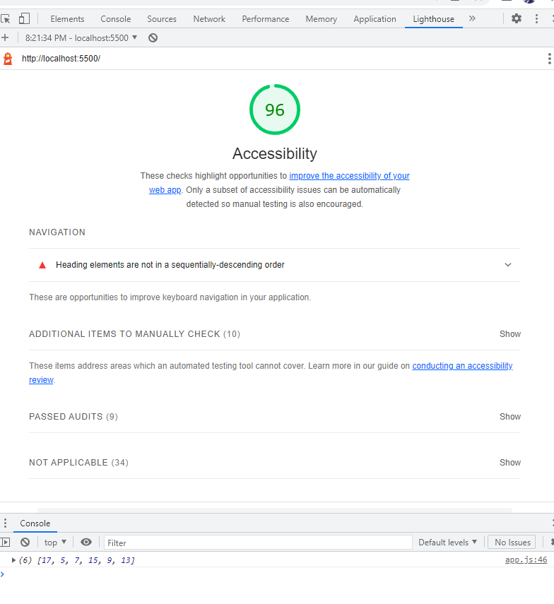

# odd-duck

Code Fellows Lab11 1- 15

### Website Overview

This website allows you to vote on 1 of 3 images displayed at a time. These images are unique, and also none-repeating
from the prior imgages. After a total of 25 votes, you will be alerted to click the Results Button. At which time, you will be presented with a graph visualizing that amount of times each image was shown and voted for.

## LightHouseLab12

## LightHouseLab15b

